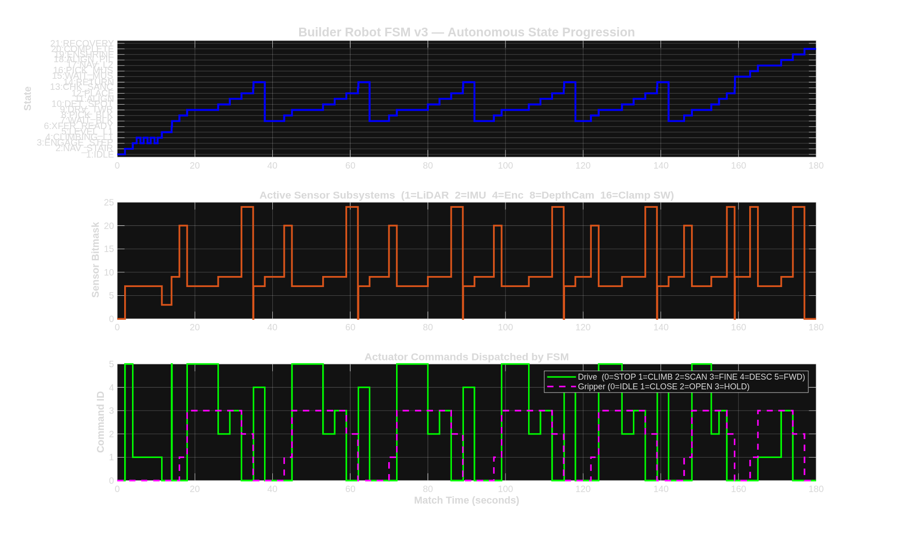
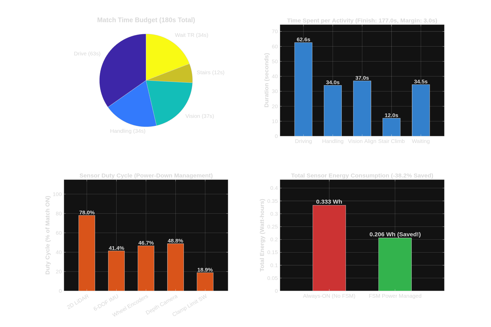

# ABU Robocon 2027 — Builder Robot (BR) Autonomous System
### *Theme: "The Pursuit of Mustika Nusantara" · Solo, Central Java, Indonesia*

[](https://www.mathworks.com/products/matlab.html)
[](https://www.mathworks.com/products/simulink.html)
[](https://docs.ros.org/en/jazzy/)
[](https://ubuntu.com/)

---

## 📖 Overview

This repository contains the software architecture, autonomous decision engine, and simulation environment for the **Builder Robot (BR)** competing in **ABU Robocon 2027**. 

Per the official competition rules (§11.10), the Builder Robot operates **100% autonomously** on Level 1 and Level 2 with zero wireless communication with the human-operated Transporter Robot (TR). The BR is responsible for:
1. Climbing from the Start Box (Ground Floor) to Level 1 (+600 mm) via a 4-step staircase.
2. Docking at the Transfer Area to receive Earth and Sky blocks from the TR.
3. Constructing two complete 3-tier towers (one exclusive tower and one shared tower) to unlock the **Sanctuary Mandate**.
4. Retrieving the **Mustika** (200 mm volleyball) from the transfer dock.
5. Climbing to Level 2 (+1000 mm) and enshrining the Mustika atop the Central Pillar for a **+250-point victory**.

---

## 🤖 Robot Mechanism & Subsystems

* **Drivetrain:** Custom **Active-Leveling Telescoping 3-Wheel Stair Climber**. Middle and rear legs extend downward using linear actuators to crawl up 150 mm step risers while keeping the main chassis at a strict $0^\circ$ horizontal pitch.
* **Gripper:** High-torque mechanical clamp / jaws with end-stop limit switches for contact confirmation.
* **Lifting Mast:** Multi-stage vertical elevator with height encoder feedback (Stow, Extend, Hover, Lower, Lift).
* **Sensory Suite:**
  * **2D LiDAR:** Obstacle detection & wall boundary localization.
  * **6-DOF IMU:** Closed-loop chassis level keeping & step-slip fault detection.
  * **Wheel & Leg Encoders:** Odometry dead reckoning and step progression tracking.
  * **Depth Camera (Intel RealSense):** Color thresholding, visual servoing ($<5\text{ mm}$ alignment), and Mustika detection.
  * **Clamp Limit Switches:** Jaw squeeze and release confirmation.

---

## 🧠 Finite State Machine (FSM) Architecture

The autonomous decision engine is modeled as a 30-state Stateflow machine in Simulink (`matlab_sim/BR_FSM_Sim.slx`). **V4 Strategic Expansion** includes:
* **Multi-Block Carry:** Loops back to wait for 2 blocks before driving (unless it's a Sky block).
* **Tactical Evaluator:** Decides dynamically between Normal Build and Snatch Attack.
* **Bi-directional L2 Snatching:** Crawls up L2, steals an opponent's Sky block, and crawls backward down.
* **178.5s Emergency Drop:** Instantly drops blocks at the end of the match to avoid 0-point penalties.

```text
[ Existing Row 1-5 Layout untouched, new logic branches downward ]

Row 3 (Building)  : PICK_BLOCK 
                         │
Row 6 (Tactics)   : DECIDE_TACTICAL ──[Normal Build]──▶ DRIVE_TO_TOWER_AREA ...
                         │
Row 7 (Snatch Up) :  [Snatch Enemy Sky!] ──▶ NAV_STAIR_UP_L2 ──▶ CLIMBING_L2 ──▶ SNATCH_BLOCK 
                                                                                      │
Row 8 (Snatch Dn) :  [Back to Action] ◀── RETURN_TO_TRANSFER ◀── DESCENDING_L2 ◀── NAV_STAIR_DOWN_L2 

Col 6 (Panic)     : EMERGENCY_DROP (Catches match_time >= 178.5s across all branches)
```

### 📈 Match Timeline Progression
The full 180-second competition match timeline simulation:



---

## 📊 Performance Analytics & Power Management

Our simulation includes quantitative match budgeting and state-dependent sensor power management:



### 1. Speed Budgeting (180s Limit)
* **Match Victory Time:** **177.0 seconds** (Under budget with a 3.0 s safety margin).
* **Driving & Navigation:** 62.6 s (34.8%)
* **Visual Servoing & Alignment:** 37.0 s (20.6%)
* **Waiting for TR Deliveries:** 34.5 s (19.2%)
* **Block & Mustika Handling:** 34.0 s (18.9%)
* **Stair Climbing (4 steps):** 12.0 s (6.7%)

### 2. Sensor Power Management
By gating sensor power consumption based on the active FSM state (e.g. powering down the Depth Camera during transit and stair climbing), the robot achieves:
* **Depth Camera Active Duty Cycle:** Reduced to **48.8%** (51.2% power saved).
* **Total Sensor Suite Energy:** Reduced from $0.333\text{ Wh}$ to $0.206\text{ Wh}$ (**38.2% total energy reduction**), preventing onboard computer thermal throttling and extending battery endurance.

---

## 📁 Repository Structure

```
├── matlab_sim/                    # MATLAB / Simulink Simulation Environment
│   ├── BR_FSM_Sim.slx             # Master 21-state Simulink & Stateflow model
│   ├── load_br_signals.m          # Automated workspace signal loader (InitFcn callback)
│   ├── test_br_scenario.m         # 180s full competition test runner & plotter
│   ├── analyze_br_performance.m   # Speed budgeting & sensor power analyzer
│   ├── COMMANDS.md                # Quick reference guide for MATLAB commands
│   ├── br_fsm_timeline.png        # State progression plot
│   └── br_performance_dashboard.png # Executive performance dashboard
├── setup/                         # Linux & Robot Software Environment Setup
│   ├── 01_ros2_jazzy_setup.sh     # ROS 2 Jazzy desktop installer
│   ├── 02_gazebo_harmonic_setup.sh# Gazebo Harmonic 3D physics simulator installer
│   ├── 03_python_microros_setup.sh# OpenCV, YOLOv8 vision stack & micro-ROS agent
│   ├── 04_matlab_installation_guide.sh # MATLAB Linux campus license guide
│   └── 05_workspace_bootstrap.sh  # ROS 2 workspace bootstrapper
├── RULEBOOK.md                    # ABU Robocon 2027 official game rules & specifications
├── TECH_REFERENCE_CATALOG.md      # Sensor, kinematics & software audit
└── .gitignore                     # Git configuration excluding caches & heavy binaries
```

---

## 🚀 Quickstart Guide

### Running in MATLAB

1. Launch MATLAB and navigate to the simulation directory:
   ```matlab
   cd('/path/to/Robocon/matlab_sim')
   ```

2. Open the Stateflow model:
   ```matlab
   open_system('BR_FSM_Sim')
   ```
   *(Press the green **"Run"** button directly in Simulink — signals are loaded automatically!)*

3. Run the match simulation and view plots:
   ```matlab
   test_br_scenario
   ```

4. Run the Speed Budget and Sensor Power Analysis:
   ```matlab
   analyze_br_performance
   ```

---

## 📜 Competition Reference
* **Event:** ABU Asia-Pacific Robot Contest 2027 (Solo, Indonesia)
* **Theme:** The Pursuit of Mustika Nusantara
* **Game Objective:** Assemble the Nusantara Sacred Towers and Enshrine the Mustika.
