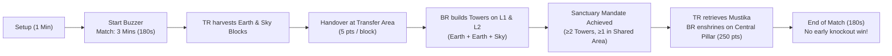
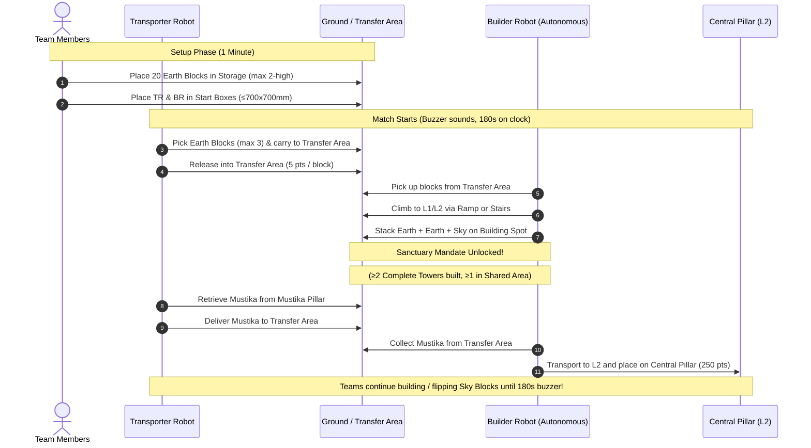

# ABU Robocon 2027 — Official Rulebook Reference
## *"The Pursuit of Mustika Nusantara"*
**Host:** Solo, Indonesia | **Venue:** Edutorium UMS | **Date:** August 29, 2027

---

## 📑 Table of Contents
1. [Theme & Story](#-theme--story)
2. [Game Overview & Match Format](#-game-overview--match-format)
3. [Game Field & Dimensional Specifications](#-game-field--dimensional-specifications)
4. [Game Objects](#-game-objects)
5. [Robot Rules & Specifications](#-robot-rules--specifications)
6. [Game Procedure & Timeline](#-game-procedure--timeline)
7. [The Sanctuary Mandate & Mustika Enshrinement](#-the-sanctuary-mandate--mustika-enshrinement)
8. [Scoring Breakdown & Point System](#-scoring-breakdown--point-system)
9. [Violations, Retries & Disqualifications](#-violations-retries--disqualifications)
10. [Tie-Breaking & Victory Conditions](#-tie-breaking--victory-conditions)
11. [Material & Color Specifications (RGB Swatches)](#-material--color-specifications-rgb-swatches)
12. [Strategic Architecture for TR & BR](#-strategic-architecture-for-tr--br)

---

## 🌟 Theme & Story
Long before modern technology, ancient visionary architects built monumental temple circuits across the Indonesian archipelago to stabilize natural forces. At the zenith of this architecture sat the **Mustika**—a sacred spherical artifact that powered the ancient Nusantara energy grid. 

In **ABU Robocon 2027**, teams field two machines:
- **Transporter Robot (TR):** Agile ground harvester delivering foundation stones (**Earth Blocks**) and retrieving the sacred **Mustika**.
- **Builder Robot (BR):** Fully autonomous master builder scaling tiered platforms (Level 1 & Level 2), constructing three-layer towers, and enshrining the Mustika atop the **Central Pillar**.

---

## ⏱️ Game Overview & Match Format



| Parameter | Specification |
|---|---|
| **Match Duration** | Fixed **3 minutes (180 seconds)** — no early knockout/instant victory |
| **Competing Teams** | Red Team vs. Blue Team |
| **Robots per Team** | **Two (2):** 1 Transporter Robot (TR) + 1 Builder Robot (BR) |
| **Control Mode** | **TR:** Manual or Autonomous | **BR:** **Strictly 100% Autonomous** |
| **Core Objective** | Build Towers (Earth + Earth + Sky) and enshrine the Mustika on the Central Pillar |
| **Ultimate Prize** | Highest total accumulated points at the final buzzer |

---

## 🗺️ Game Field & Dimensional Specifications

The field is a **11,000 mm × 11,000 mm (11 m × 11 m)** three-tiered stepped arena.

```
+-----------------------------------------------------------------------+
|                             GAME FIELD (11m x 11m)                    |
|                                                                       |
|   [RED START ZONES]                               [BLUE START ZONES]  |
|   (TR & BR boxes: 700x700)                        (TR & BR boxes)     |
|                                                                       |
|   [RED STORAGE AREA]                             [BLUE STORAGE AREA]  |
|   (1000x2000 mm: 20 Earth Blocks)                (20 Earth Blocks)    |
|                                                                       |
|                        [GROUND SHARED AREA]                           |
|                    (1200x1200 mm: 12 Sky Blocks)                      |
|                                                                       |
|                 [MUSTIKA PILLAR (Shared Ground)]                      |
|                 (H: 500mm, Dia: 270mm, Ball: Mikasa)                  |
|                                                                       |
|   =================================================================   |
|   LEVEL 1 (L1) - Elevated +600 mm (6000 mm x 6000 mm)                 |
|   - Reached via Ramp (3500mm L) or Stairs (Step H: 150mm, W: 1000mm)  |
|   - Transfer Area (1000 x 1000 mm) at Red & Blue boundaries           |
|   - L1 Building Spots (500 x 500 mm, Green)                           |
|   - L1 Shared Area (Contested center zone)                            |
|   - L1 Retry Zone (700 x 700 mm)                                      |
|                                                                       |
|       ---------------------------------------------------------       |
|       LEVEL 2 (L2) - Elevated +900 mm (+300 mm above L1, 3m x 3m)     |
|       - Reached via L2 Stairs (Step H: 150mm, W: 1000mm)              |
|       - Entire L2 is a Shared Contested Area                          |
|       - L2 Building Spots (500 x 500 mm, Green)                       |
|       - CENTRAL PILLAR (Dia: 270 mm, Top Receptacle)                  |
|       ---------------------------------------------------------       |
+-----------------------------------------------------------------------+
```

### Key Field Zones

| Zone Name | Dimensions | Elevation | Permitted Robots | Description / Purpose |
|---|---|---|---|---|
| **Ground Area** | Main lower floor | 0 mm | TR (BR during start/retry) | Primary harvesting floor for TR |
| **Start / Retry Zone (Ground)** | 700 × 700 mm (2 boxes) | 0 mm | TR & BR | Starting boxes; team selects which box for which robot |
| **Storage Area** | 1000 × 2000 mm | 0 mm | TR only | Holds 20 team Earth Blocks (stacked max 2 high) |
| **Ground Shared Area** | 1200 × 1200 mm | 0 mm | TR (both teams) | Holds 12 Sky Blocks in alternating 5×5 chessboard pattern |
| **Mustika Pillar (Ground)** | ∅ 270 mm, H: 500 mm | +500 mm | TR (both teams) | Receptacle (∅180 mm, depth 100 mm) holding Mustika |
| **Transfer Area** | 1000 × 1000 mm | +600 mm (L1 boundary) | TR & BR | Handover station between TR and BR |
| **Level 1 (L1)** | 6000 × 6000 mm | +600 mm | BR only | Mid platform; accessed via Ramp (3.5 m) or Stairs |
| **L1 Retry Zone** | 700 × 700 mm | +600 mm | BR only | Recovery zone for BR once it has entered L1 |
| **L1 Shared Area** | Contested center | +600 mm | BR (both teams) | Shared building zone between Red and Blue sides |
| **Level 2 (L2)** | 3000 × 3000 mm | +900 mm (+300 mm from L1) | BR only | Highest platform; entirely shared between both teams |
| **Central Pillar (L2)** | ∅ 270 mm | Elevated on L2 | BR only | Final destination for Mustika enshrinement |
| **Building Spots** | 500 × 500 mm | L1 and L2 | BR only | Green marked squares for Complete Tower construction |

---

## 📦 Game Objects

### 1. Earth Block (Foundation & Middle Layer)
- **Dimensions:** 350 mm × 350 mm × 350 mm cubic box (±5% tolerance)
- **Weight:** ~600 g (±20%)
- **Quantity:** 20 units per team (placed in team's Storage Area)
- **Material:** 3-layer corrugated cardboard, all 6 sides stickered
- **Colors:** Solid Red (RGB: `223-34-34`) or Solid Blue (RGB: `50-0-255`)
- **Role:** Layers 1 and 2 of every Complete Tower

### 2. Sky Block (Crown Layer / Cap)
- **Dimensions:** 200 mm × 200 mm × 200 mm cubic box (±5% tolerance)
- **Weight:** ~220 g (±20%)
- **Quantity:** 12 units total (shared in Ground Shared Area)
- **Material:** BOPP matte finish, single-wall corrugated board with **reinforced claws/hooks** (designed to allow suction/gripper lifting without box tearing)
- **Colors:** Dual-color — **Red on one face, Blue on the opposite face**
- **Scoring Dynamic:** Scores for the team whose color faces **UP** at the match end. **Can be flipped/stolen by the opponent!**

### 3. The Mustika (The Great Artifact)
- **Object:** Official **Mikasa V300W Volleyball** (Size 5, ∅ ~210 mm, circumference 65–67 cm)
- **Weight:** 260–280 g
- **Colors:** Original synthetic leather (Yellow Pantone 1235C & Blue Pantone 3591C)
- **Value:** **250 Points** upon successful enshrinement atop Central Pillar

---

## 🤖 Robot Rules & Specifications

### Physical & Dimension Constraints

| Specification | Transporter Robot (TR) | Builder Robot (BR) |
|---|---|---|
| **Control Mode** | Manual or Autonomous | **Strictly Autonomous (100%)** |
| **Starting Size** | ≤ 700 mm × 700 mm × 700 mm | ≤ 700 mm × 700 mm × 700 mm |
| **Maximum Operating Extension** | ≤ 1000 mm (W) × 1400 mm (L) × 1200 mm (H) | ≤ 1000 mm (W) × 1400 mm (L) × 1200 mm (H) |
| **Maximum Weight** | ≤ **50 kg** (including battery, controllers, cables) | ≤ **50 kg** (including battery, controllers, cables) |
| **Max Capacity at One Time** | Maximum **3 blocks** | Maximum **2 blocks** |
| **Allowed Operating Zones** | Ground Area & Transfer Area only | Transfer Area, Level 1, Level 2 |
| **L1 / L2 Access** | **Strictly prohibited** beyond Transfer Area boundary | Permitted throughout L1 and L2 |

### Electrical & Power Rules
- **Power Sources Allowed:** Batteries, compressed air, elastic force only.
- **Battery Limits:**
  - Maximum **Nominal Voltage ≤ 24V** (total in series ≤ 24V).
  - Maximum **Circuit Voltage ≤ 42V** at any point in any isolated circuit.
- **Prohibited Batteries:** Lead-acid batteries and adhesive-sealed liquid batteries are strictly forbidden.
- **Pneumatics:** Purpose-built pressure vessel or safe plastic bottle; **maximum air pressure ≤ 600 kPa (6 bar)**.
- **Lasers:** Must strictly be Class 1 or Class 2 (IEC 60825-1 certified).

### Wireless Communication Rules (§11.8 - §11.10)
- **Allowed Frequencies:** **Wi-Fi (IEEE 802.11)**, **Zigbee (IEEE 802.15)**, **Bluetooth** only.
- **Inter-Robot Communication Ban (§11.10):**
  > [!CAUTION]
  > **TR and BR are STRICTLY PROHIBITED from communicating with each other during the game.**  
  > No Wi-Fi, Bluetooth, Zigbee, optical, or RF messages between TR and BR! Handover must be mechanically/optically sensed.

### Emergency & Safety Requirements
- Both robots must have an easily accessible, visible **red Emergency STOP button**.
- Remote wireless E-stop is strongly recommended.
- Flying mechanisms, drones, or flame/explosive sources are strictly prohibited.
- **Suction mechanisms:** Allowed, provided they do not leave adhesive residue or damage field objects.

### Robot Transportation Box (§11.16)
- Exactly one (1) shipping box: max **1500 mm × 800 mm × 900 mm**, gross weight ≤ **180 kg**.

---

## 🔄 Game Procedure & Timeline



---

## 🏛️ The Sanctuary Mandate & Mustika Enshrinement

### Complete Tower Definition
A tower is legally complete **only** when constructed on a designated 500 mm × 500 mm Building Spot with exactly:
1. **Layer 1 (Bottom):** Earth Block
2. **Layer 2 (Middle):** Earth Block
3. **Layer 3 (Top):** Sky Block

### The Sanctuary Mandate Requirement (§3.6)
Before a team is legally permitted to touch and retrieve the **Mustika**:
- The team must build at least **two (2) Complete Towers**.
- At least **one (1) of those towers must be in an upper Shared Area** (either L1 Shared Area or L2 Shared Area).
- **Permanence:** Once unlocked, the Sanctuary Mandate remains unlocked even if the opponent later flips the Sky Block on the shared tower.

### Enshrining the Mustika
- Only TR can retrieve the Mustika from the ground Mustika Pillar.
- TR delivers it to the Transfer Area.
- BR picks it up from the Transfer Area and carries it up to **Level 2**.
- BR places the Mustika into the **receptacle of the Central Pillar**.
- Must be freely standing (not held by robot) when the match ends to claim **250 points**.

---

## 🎯 Scoring Breakdown & Point System

### 1. Transfer Points (TR Logistics)
- **+5 Points** for every Earth Block or Sky Block delivered completely into the Transfer Area.
- Awarded permanently (remains scored even after BR takes the block).

### 2. Tower Building Points (BR Placement)

| Tower Element | Level 1 (L1) Value | Level 2 (L2) Value |
|---|---|---|
| **Earth Block — Layer 1 (Bottom)** | **10 Points** | **20 Points** |
| **Earth Block — Layer 2 (Middle)** | **20 Points** | **40 Points** |
| **Sky Block — Layer 3 (Crown/Cap)** | **40 Points** | **80 Points** |
| **Total for One Complete Tower** | **70 Points** | **140 Points** |

### 3. Sky Block Flipping & Tower Stealing (§8.3)
- **Earth Blocks are locked:** Points belong permanently to the team that placed them. Opponent cannot steal foundation points.
- **Sky Blocks belong to upward color:**
  - If Red is facing UP at the buzzer $\rightarrow$ Red gets 40 (L1) or 80 (L2) pts.
  - If Blue flips it to Blue facing UP $\rightarrow$ Blue gets 40 (L1) or 80 (L2) pts.
  - Flipping a Sky Block does **not** transfer the underlying Earth Block points!

### 4. Mission Points (The Mustika)
- **+250 Points** for the Mustika placed and resting stably on the Central Pillar at the final buzzer.

### 5. Invalid Scoring Situations (0 Points)
- Any object **still touched or gripped by a robot** when the 180s buzzer sounds.
- Blocks placed out of order (must strictly be Earth $\rightarrow$ Earth $\rightarrow$ Sky).
- Blocks pushed/dragged along the floor instead of actively lifted.
- Blocks knocked out of the green Building Spot boundary.

---

## ⚠️ Violations, Retries & Disqualifications

### Violations (Results in Forced Retry)
1. **No-Pushing Rule (§6.1):** Dragging, sliding, or bulldozing blocks along the floor. Blocks must be lifted cleanly.
2. **Zone Violation (§6.2):** TR extending any mechanism past Transfer Area into L1/L2, or robot entering opponent's non-shared territory.
3. **Handover Violation (§6.3):** BR grabbing objects outside the Transfer Area airspace.
4. **Interference in Shared Areas (§6.6):** Intentionally blocking, pushing, or colliding with the opponent's robot while they manipulate blocks.
5. **Unauthorized Touching (§6.7):** Team member touching robots/field without referee approval.

### Retry Protocols (§5)
- Team Leader raises hand and shouts **"Retry!"**.
- **TR Reset:** Must return to the Ground Start Zone.
- **BR Reset:**
  - Returns to Ground Start Zone, OR
  - Returns to **L1 Retry Zone** (only if BR had successfully reached L1 earlier in the match).
- **Objects held during retry:**
  - Earth/Sky blocks held may be kept by the robot upon restart.
  - **The Mustika must be returned to the Mustika Pillar!**

### Disqualifications (Immediate 0 Points & Match Loss)
- Intentionally damaging the field, blocks, or opponent robots.
- Intentionally displacing an opponent's placed Earth Block on a Building Spot.
- Severe safety hazards (fire, smoke, flying high-speed debris).
- Disrespecting referees or unsportsmanlike behavior.

---

## 🏆 Tie-Breaking & Victory Conditions

Match duration is always **exactly 180 seconds**. The winner is the team with the highest total score:
$$\text{Total Score} = \text{Transfer Points} + \text{L1 Block Points} + \text{L2 Block Points} + \text{Mustika Points (250)}$$

### Tie-Breaker Hierarchy (in descending order):
1. **Mustika Enshrinement:** Team that successfully enshrined the Mustika on the Central Pillar.
2. **Sky Blocks Count:** Higher number of upward-facing team-colored Sky Blocks across the whole field.
3. **L2 Placement:** Higher total number of blocks (Earth + Sky) placed on Level 2 Building Spots.
4. **L1 Placement:** Higher total number of blocks (Earth + Sky) placed on Level 1 Building Spots.
5. **Referee Panel Decision:** Evaluation based on technical performance and sportsmanship.

---

## 🎨 Material & Color Specifications (RGB Swatches)

Useful for vision calibration (OpenCV / YOLO / HSV color thresholding):

| Element | Material | RGB Values | Hex Code | Visual Note |
|---|---|---|---|---|
| **Ground Area (Red)** | Plywood, Water Paint | `240, 210, 210` | `#F0D2D2` | Light pinkish red |
| **Ground Area (Blue)** | Plywood, Water Paint | `170, 210, 230` | `#AAD2E6` | Light sky blue |
| **Shared Area (Ground & L1)** | Plywood, Water Paint | `245, 240, 200` | `#F5F0C8` | Cream / Pale yellow |
| **Red Start & Retry Zone** | Plywood, Water Paint | `223, 34, 34` | `#DF2222` | Vivid Red |
| **Blue Start & Retry Zone** | Plywood, Water Paint | `50, 0, 255` | `#3200FF` | Vivid Blue |
| **Building Spot (L1 & L2)** | Plywood, Water Paint | `40, 100, 50` | `#286432` | Dark Green |
| **Level 2 Platform & Walls** | Plywood, Water Paint | `190, 190, 185` | `#BEBEB9` | Neutral Grey |
| **Transfer Area (Red)** | Plywood, Water Paint | `245, 170, 60` | `#F5AA3C` | Amber Orange |
| **Transfer Area (Blue)** | Plywood, Water Paint | `60, 170, 245` | `#3CAAF5` | Bright Cyan |
| **Mustika & Central Pillar** | PVC pipe ∅270mm, Oil Paint | `100, 62, 0` | `#643E00` | Dark Brown |
| **Earth Block (Red)** | Corrugated Box, Sticker | `223, 34, 34` | `#DF2222` | Solid Red |
| **Earth Block (Blue)** | Corrugated Box, Sticker | `50, 0, 255` | `#3200FF` | Solid Blue |
| **Mustika (Mikasa V300W)** | Synthetic Leather | Pantone 1235C & 3591C | Yellow & Royal Blue | Competition Volleyball |

---

## 🛠️ Strategic Architecture for TR & BR

```
+-------------------------------------------------------------------------+
|                       RECOMMENDED ROBOT SUBSYSTEMS                      |
+------------------------------------+------------------------------------+
|     TRANSPORTER ROBOT (TR)         |        BUILDER ROBOT (BR)          |
+------------------------------------+------------------------------------+
| • Omnidirectional Drivetrain       | • High-traction stair/ramp crawler |
|   (4x Mecanum or Swerve Drive)     |   (Tracked or high-torque 4WD)     |
| • Multi-block gripper / rack       | • Multi-stage vertical lift / arm  |
|   (Carries up to 3 Earth blocks)   |   (Lifts Earth & Sky up to 1.2m)   |
| • Ground vacuum / suction cup      | • Vacuum suction or clamp gripper  |
|   (Fast pickup of Sky blocks)      |   (Picks 350mm & 200mm cubes)      |
| • Volleyball cup gripper           | • Autonomous Nav2 navigation       |
|   (Pick Mustika from 500mm pillar) |   (2D LiDAR + Depth Camera / IMU)  |
| • Quick-release transfer tray      | • Visual servoing / AprilTags      |
|   (Deposits into Transfer Area)    |   (Aligns to green 500mm spots)    |
| • Manual wireless operator link    | • Stateflow / ROS2 BehaviorTree    |
|   (Wi-Fi / Bluetooth gamepad)      |   (Fully autonomous state machine) |
+------------------------------------+------------------------------------+
```

> [!TIP]
> **Key Autonomous Strategy:** Prioritize building one tower in your team's L1 exclusive zone and one tower in the L1/L2 Shared Area as fast as possible to unlock the **Sanctuary Mandate**. Once unlocked, rush the Mustika for an insurmountable **250-point lead**!
